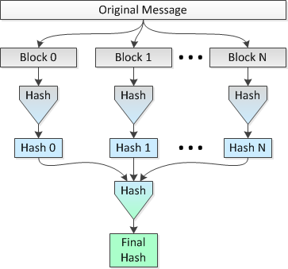

Sha224 Tree
===========

*	A tree style hashing using sha224.
*	Currently time reduced by **2** sec for 1GB file.





Usage
=====
```sh
$	python hash.py --help
	
	usage: hash.py [-h] [-1] [-2] [-3] [-4] [-5] [-f FILE]

	optional arguments:
	  -h, --help            show this help message and exit
	  -1, --sha1
	  -2, --sha224
	  -3, --sha256
	  -4, --sha384
	  -5, --sha512
	  -f FILE, --file FILE  The path to the file
	  
```

Things to do
============

*	[x] Use multiprocessing 
*	[ ] Increase Efficinecy

